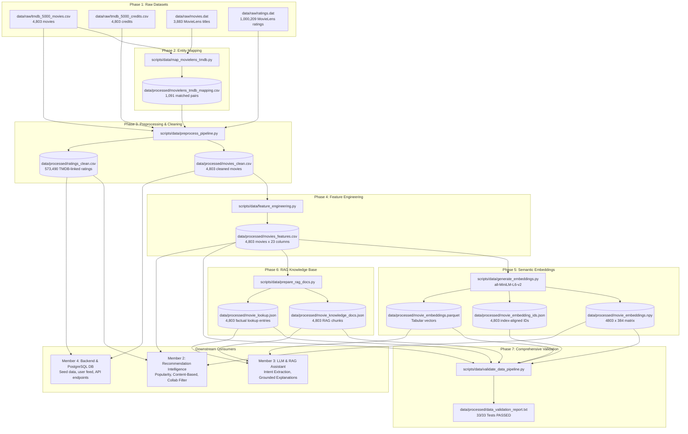

# Movie Intelligence & Data Engineering Pipeline Documentation

## 1. Executive Summary & Pipeline Overview

The **Movie Intelligence & Data Engineering Pipeline** (owned by **Team Member 1**) builds, normalizes, enriches, and validates the foundational datasets required by all subsystems of the **AI-Powered Social OTT Discovery & Recommendation Platform**.

It ingests raw metadata from **The Movie Database (TMDB 5000)** and user interaction ratings from **MovieLens 1M**, resolves cross-dataset entity identities, engineers rich NLP and numerical features, computes dense 384-dimensional vector embeddings, constructs structured RAG knowledge documents, and rigorously validates 100% ID consistency across all artifacts.

---

## 2. End-to-End Architecture & Data Flow



---

## 3. Dataset Statistics Summary

| Dataset / Artifact | Total Records | Key Characteristics |
|---|---|---|
| **Raw TMDB Movies** | 4,803 | 20 columns, complex JSON strings for genres & keywords |
| **Raw TMDB Credits** | 4,803 | Cast & crew records for all 4,803 movies |
| **Raw MovieLens Titles** | 3,883 | `MovieID::Title (Year)::Genres` |
| **Raw MovieLens Ratings** | 1,000,209 | User ratings (scale 1–5) from 6,040 users |
| **MovieLens $\to$ TMDB Matches** | 1,091 | Deterministic high-confidence matches (0 collisions) |
| **Clean TMDB Movies** | 4,803 | Clean parsed JSON, directors (99.4%), top 5 cast (100%) |
| **Clean Linked Ratings** | 573,490 | 100% mapped to valid TMDB movie IDs across 6,040 users |
| **Engineered Features** | 4,803 $\times$ 23 | Composite text, genre text, people text, era buckets, normalized scores |
| **Dense Vector Embeddings** | 4,803 $\times$ 384 | L2-normalized float32 vectors generated via `all-MiniLM-L6-v2` |
| **RAG Knowledge Chunks** | 4,803 | High-density structured documents with full metadata |
| **Factual Lookup Catalog** | 4,803 | Fast $O(1)$ dictionary keyed by `movie_id` |

---

## 4. Phase-by-Phase Technical Breakdown

### Phase 1: Dataset Collection & Verification
* Verified presence, integrity, and encoding of raw datasets in `data/raw/`.
* Discovered that MovieLens `.dat` files use `latin-1` encoding and `::` delimiter, while TMDB uses standard UTF-8 CSVs.

### Phase 2: MovieLens $\to$ TMDB Movie ID Mapping (`scripts/data/map_movielens_tmdb.py`)
* **Challenge:** MovieLens uses internal sequential IDs (e.g. *Toy Story* = `1`), while TMDB uses its global database ID (e.g. *Toy Story* = `862`).
* **Multi-Stage Deterministic Matcher:**
  1. **Priority 1 (`exact_title_and_year`):** Normalized title match with exact release year match (1,051 matches, confidence = 1.0).
  2. **Priority 2 (`exact_title_year_diff_1`):** Normalized title match with $|\text{year}_{\text{ML}} - \text{year}_{\text{TMDB}}| \le 1$ to handle international vs domestic release lag (35 matches, confidence = 0.95).
  3. **Priority 3 & 4 (`alt_title_and_year` / `original_title_and_year`):** Extracted foreign/alternate titles in parentheses or TMDB original title (5 matches, confidence = 0.90).
* **Result:** **1,091 movies matched** with **0 duplicate collisions** and **0 false-positive hallucinations**.

### Phase 3: Data Cleaning & Preprocessing (`scripts/data/preprocess_pipeline.py`)
* **JSON Parsing:** Extracted clean string lists from stringified JSON dictionaries for `genres`, `keywords`, and `cast`.
* **Director & Cast Extraction:** Extracted the director from TMDB crew records (`job == "Director"`, 99.4% found) and top 5 billed actors from cast records.
* **Date & Runtime Sanitization:** Converted `release_date` to integer `release_year`, cast runtime to integer minutes, and safely handled missing overviews (4 movies).
* **Ratings Sanitization:** Filtered 1,000,209 MovieLens ratings down to 573,490 high-confidence ratings linked directly to `tmdb_movie_id`. Excluded unmatched ratings to prevent corrupted collaborative filtering matrices.

### Phase 4: Feature Engineering (`scripts/data/feature_engineering.py`)
Generates 7 new high-utility feature columns in `movies_features.csv`:
1. **`combined_text`**: Complete semantic document combining Title, Overview, Genres, Keywords, Director, and Cast.
2. **`genre_text`**: Clean, comma-separated genres string (e.g. `"Action, Adventure, Fantasy, Science Fiction"`).
3. **`people_text`**: Comma-separated director and top cast names (e.g. `"James Cameron, Sam Worthington, Zoe Saldana, Sigourney Weaver..."`).
4. **`year_bucket`**: Era category (`before_1990`, `1990_1999`, `2000_2009`, `2010_2019`, `2020_plus`).
5. **`rating_score`**: TMDB `vote_average` score (0.0 to 10.0 scale).
6. **`popularity_score_normalized`**: Min-Max scaled popularity score within $[0.0, 1.0]$.
7. **`vote_count_log`**: Log-transformed vote count (`log1p`) to dampen extreme blockbuster bias.

#### Structure of `combined_text`:
```text
Title: Avatar. Overview: In the 22nd century, a paraplegic Marine is dispatched to the moon Pandora on a unique mission, but becomes torn between following orders and protecting an alien civilization. Genres: Action, Adventure, Fantasy, Science Fiction. Keywords: culture clash, future, space war, space colony, society, space travel, futuristic, romance, space, alien, tribe, alien planet, cgi, marine, soldier, battle, love affair, anti war, power relations, mind and soul, 3d. Director: James Cameron. Cast: Sam Worthington, Zoe Saldana, Sigourney Weaver, Stephen Lang, Michelle Rodriguez.
```

### Phase 5: Movie Embeddings (`scripts/data/generate_embeddings.py`)
* **Model:** `sentence-transformers/all-MiniLM-L6-v2` (384-dimensional dense representations).
* **Target Field:** `combined_text`.
* **Normalization:** All vectors are **L2 unit-normalized** ($\|\mathbf{v}\|_2 = 1.0000$). Cosine similarity between movies $\mathbf{u}$ and $\mathbf{v}$ is computed via simple dot product:
  $$\text{CosineSimilarity}(\mathbf{u}, \mathbf{v}) = \mathbf{u} \cdot \mathbf{v}$$
* **Outputs:**
  * `movie_embeddings.npy`: `(4803, 384)` float32 dense matrix (7.38 MB).
  * `movie_embedding_ids.json`: List of 4,803 integer movie IDs matching row order in `.npy`.
  * `movie_embeddings.parquet`: Tabular format with `movie_id`, `title`, and vector list.

### Phase 6: RAG Knowledge Document Preparation (`scripts/data/prepare_rag_docs.py`)
* Created **4,803 structured knowledge documents** in `movie_knowledge_docs.json`.
* Each document contains:
  * `doc_id`: Unique string (`"movie_19995"`).
  * `movie_id`: TMDB integer ID.
  * `title`: Primary movie title.
  * `content`: Structured textual passage designed for vector DB indexing and LLM prompt context.
  * `metadata`: Complete factual dictionary (genres, cast, director, runtime, release year, rating, popularity).
* Created `movie_lookup.json`: Key-value catalog mapping `movie_id` $\to$ metadata dictionary for $O(1)$ factual grounding.

### Phase 7: Comprehensive Data Validation (`scripts/data/validate_data_pipeline.py`)
* Automated test suite executing **33 validation checks** across all generated artifacts.
* **Results:** **33 / 33 Checks PASSED**, **0 Failures**, **0 Warnings**.
* **Cross-Artifact Consistency:** **100.00% movie ID parity** across `movies_clean.csv`, `movies_features.csv`, `movie_embeddings.npy`, `movie_embeddings.parquet`, `movie_knowledge_docs.json`, and `movie_lookup.json`.

---

## 5. Artifact Directory & File Dictionary

All processed artifacts reside in [`data/processed/`](file:///c:/Users/kunch/OneDrive/文件/Hackthons/Cognizant%20Placement%20Hackthon%20-%202026/AI-Powered-Social-OTT-Discovery-Recommendation-Platform/data/processed/):

| File Name | Format | Size | Description | Primary Consumer |
|---|---|---|---|---|
| `movies_clean.csv` | CSV | 3.2 MB | 4,803 cleaned movies with parsed genres, keywords, cast, and director | Member 4 (DB Seed) |
| `ratings_clean.csv` | CSV | 15.7 MB | 573,490 ratings linked to valid TMDB movie IDs | Member 2 (Collab Filtering) |
| `movielens_tmdb_mapping.csv` | CSV | 247 KB | Complete mapping table between MovieLens IDs and TMDB IDs | Member 1 & 2 |
| `movies_features.csv` | CSV | 6.7 MB | 4,803 movies $\times$ 23 features including `combined_text`, `genre_text`, `people_text` | Member 2 (Content & Hybrid Rec) |
| `movie_embeddings.npy` | NumPy NPY | 7.4 MB | `(4803, 384)` float32 dense semantic embeddings matrix | Member 2 (Content Similarity Matrix) |
| `movie_embedding_ids.json` | JSON | 32 KB | Ordered list of 4,803 movie IDs matching `.npy` matrix rows | Member 2 & 3 |
| `movie_embeddings.parquet` | Parquet | 11.7 MB | Tabular DataFrame with `movie_id`, `title`, and vector array | Member 3 (Vector DB Ingestion) |
| `movie_knowledge_docs.json` | JSON | 7.9 MB | 4,803 rich RAG knowledge documents with content and metadata | Member 3 (RAG Vector Store & Context) |
| `movie_lookup.json` | JSON | 3.7 MB | Fast $O(1)$ factual metadata dictionary keyed by `movie_id` | Member 3 (Grounded Explanations) |
| `data_validation_report.txt` | Text | 3.7 KB | Full audit report of all 33 automated validation tests | All Team Members |

---

## 6. Downstream Consumption Guides

### How Member 2 (Recommendation Intelligence) Should Consume Data:

1. **Popularity-Based Recommendations:**
   * Load `data/processed/movies_features.csv`.
   * Use `rating_score`, `popularity_score_normalized`, and `vote_count_log` to compute weighted Bayesian ratings:
     $$W = \frac{v}{v + m} R + \frac{m}{v + m} C$$

2. **Content-Based Filtering (Cosine Similarity):**
   * Load `data/processed/movie_embeddings.npy` and `data/processed/movie_embedding_ids.json`.
   * Since vectors are unit-normalized, the complete pairwise similarity matrix can be computed instantly via:
     ```python
     import numpy as np, json

     embeddings = np.load("data/processed/movie_embeddings.npy")
     with open("data/processed/movie_embedding_ids.json") as f:
         movie_ids = json.load(f)

     # Fast similarity for a given movie index i:
     similarities = np.dot(embeddings, embeddings[i])
     top_k_indices = np.argsort(similarities)[::-1][1:top_k+1]
     top_k_movie_ids = [movie_ids[idx] for idx in top_k_indices]
     ```

3. **Collaborative Filtering (Matrix Factorization / ALS / SVD):**
   * Load `data/processed/ratings_clean.csv`.
   * Directly build user-item sparse interaction matrix with columns `user_id`, `tmdb_movie_id`, and `rating`.

---

### How Member 3 (AI / RAG & Explainability) Should Consume Data:

1. **Vector Index Ingestion (ChromaDB / FAISS / pgvector):**
   * Load `data/processed/movie_knowledge_docs.json` and `data/processed/movie_embeddings.parquet`.
   * Ingest `content` as chunk text, `metadata` as vector metadata, and pre-computed 384-d vectors directly into vector storage without recomputing embeddings.

2. **Grounded Fact Checking & Hallucination Prevention:**
   * Load `data/processed/movie_lookup.json`.
   * When the LLM explains a recommendation for `movie_id`, retrieve verified factual details (runtime, director, genres, cast) in $O(1)$ time to inject into explanation guardrail prompts.

---

### How Member 4 (Backend & Database Orchestration) Should Consume Data:

1. **Database Seeding:**
   * Ingest `data/processed/movies_clean.csv` to seed the PostgreSQL `movies` table.
   * Ingest `data/processed/ratings_clean.csv` to seed historical `ratings` and social user interactions.

---

## 7. Assumptions & Limitations

1. **Dataset Scope:** The dataset contains the TMDB 5,000 subset (4,803 active movies). 2,792 obscure titles in MovieLens 1M that do not exist in TMDB 5,000 were safely excluded to maintain metadata quality.
2. **Deterministic Matching:** Title matching strictly requires release year alignment ($\le 1$ year difference) to prevent false-positive links between different films with identical titles.
3. **Embeddings:** Computed using CPU/GPU-compatible `all-MiniLM-L6-v2`, providing high semantic search quality at low latency (21.9 movies/sec encoding rate).

---

## 8. Reproducibility & Pipeline Execution Commands

To reproduce the entire pipeline from scratch, run the scripts in sequential order:

```bash
# 1. Map MovieLens titles to TMDB movie IDs
python scripts/data/map_movielens_tmdb.py

# 2. Clean TMDB metadata and MovieLens ratings
python scripts/data/preprocess_pipeline.py

# 3. Engineer composite text and numerical features
python scripts/data/feature_engineering.py

# 4. Generate 384-dimensional dense semantic embeddings
python scripts/data/generate_embeddings.py

# 5. Build structured RAG knowledge documents & lookup catalog
python scripts/data/prepare_rag_docs.py

# 6. Execute comprehensive data validation test suite
python scripts/data/validate_data_pipeline.py
```
